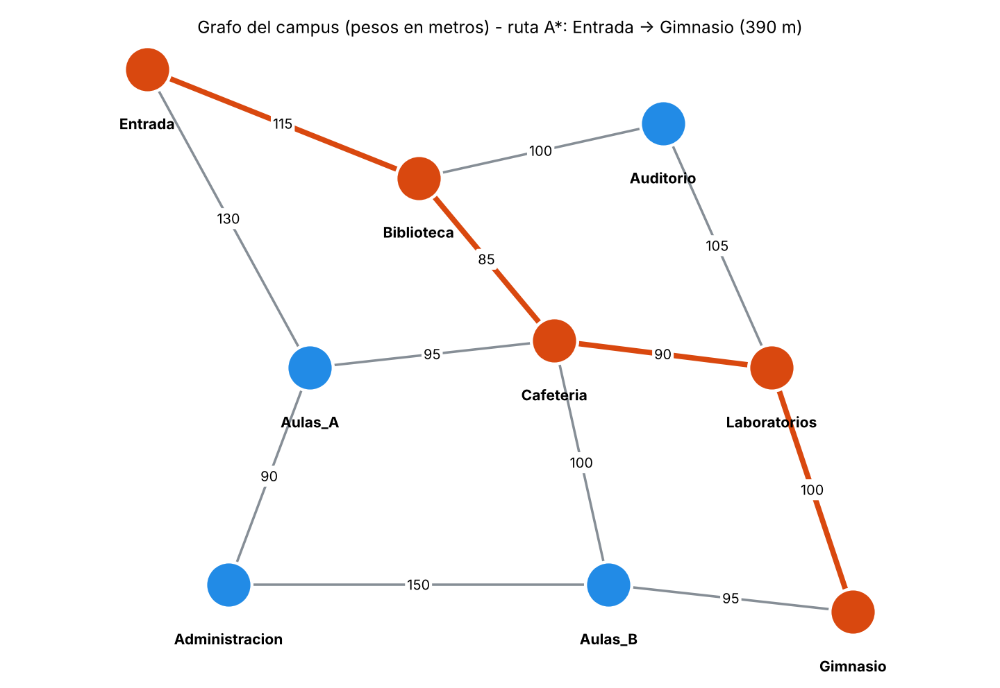
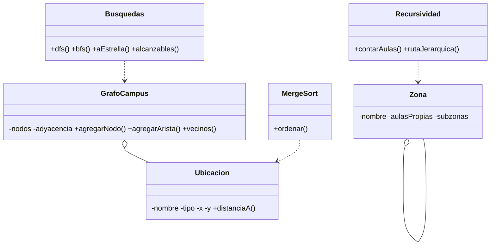
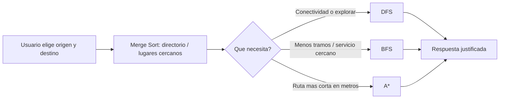

# Diagramas

## Grafo del campus

## Diagrama de clases

```mermaid
classDiagram
    class Ubicacion { -nombre -tipo -x -y +distanciaA() }
    class Zona { -nombre -aulasPropias -subzonas }
    class GrafoCampus { -nodos -adyacencia +agregarNodo() +agregarArista() +vecinos() }
    class Busquedas { +dfs() +bfs() +aEstrella() +alcanzables() }
    class Recursividad { +contarAulas() +rutaJerarquica() }
    class MergeSort { +ordenar() }
    GrafoCampus o-- Ubicacion
    Zona o-- Zona
    Busquedas ..> GrafoCampus
    Recursividad ..> Zona
    MergeSort ..> Ubicacion
```

## Flujo del módulo de orientación

```mermaid
flowchart LR
    A[Usuario elige origen y destino] --> B[Merge Sort: directorio / lugares cercanos]
    B --> C{Que necesita?}
    C -->|Conectividad o explorar| D[DFS]
    C -->|Menos tramos / servicio cercano| E[BFS]
    C -->|Ruta mas corta en metros| F[A*]
    D --> G[Respuesta justificada]
    E --> G
    F --> G
```
